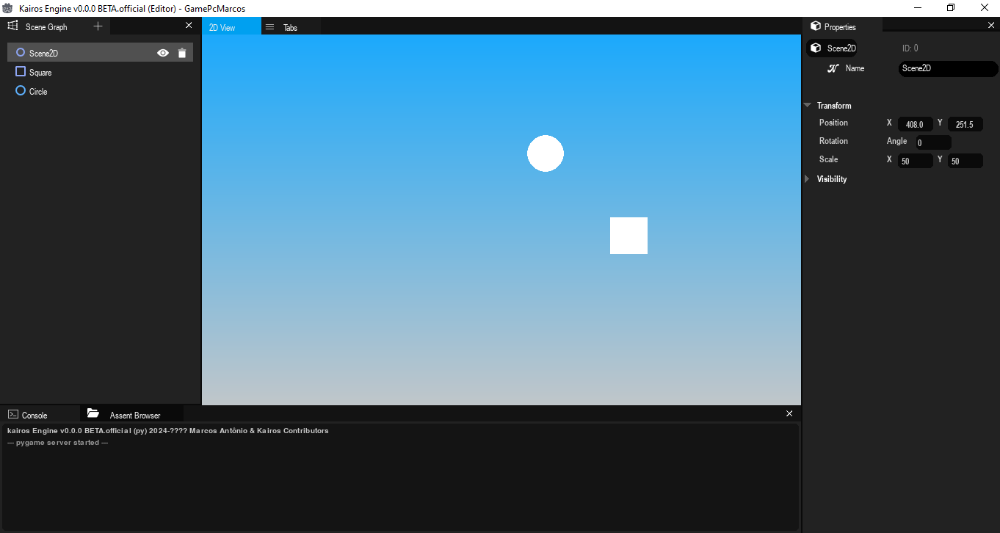

----------------------------------------------

a Kairos e um motor de jogo feito em pygame 
mas nao se deixe enganar apesar de ser feito em pygame 
apresenta um otimo desempenho que nao deixa a desejar ,
e se o problema e desempenho a kairos conta com um compilador para rodar seu game e importalo 
escrito em C com OpenGL , e nao para por ae , a Kairos apresenta um compilador bastante modular e flexivel 
ou seja recebera bastantes atualizaçoes como em um futuro um escrito com Vulkan ou c++ , como ele apresenta 
uma grande flexibilidade voçe mesmo é capaz de escrever o seu com qualquer linguagem e biblioteca grafica

----------------------------------------------

versoes: 

Kairos v0.0.1 Alpha
Console v0.0.1 Stable
Compilador_C v0.0.0 Alpha
Compilador_Engine v0.0.1 Beta